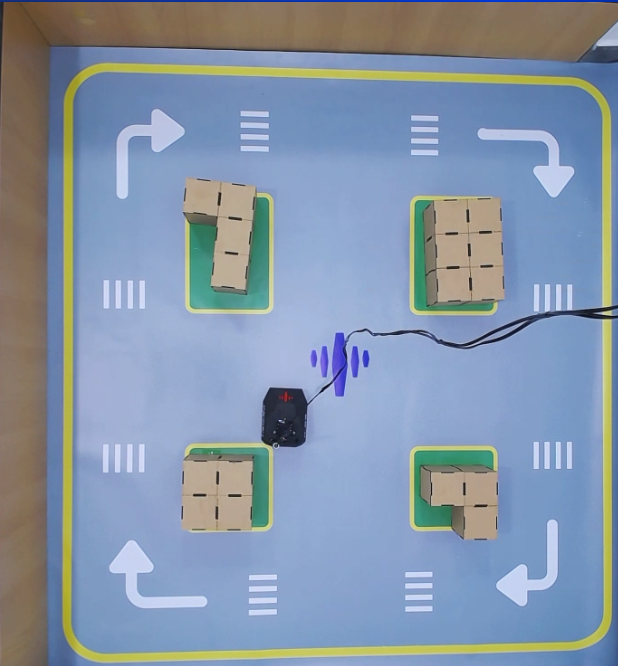
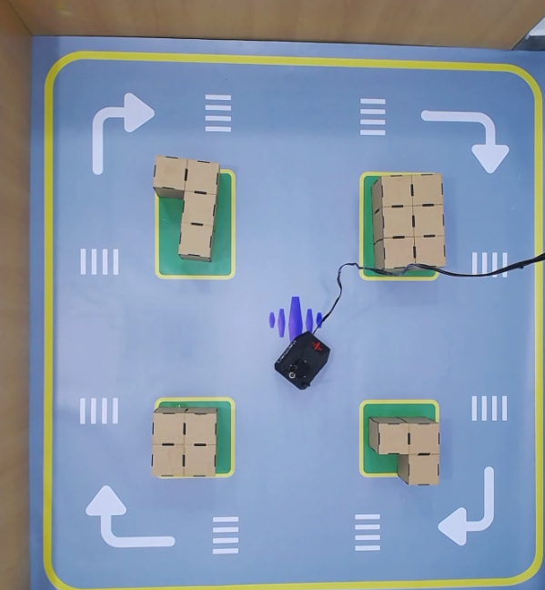

# Kit-Kalman Demos

Nodos ROS 2 de demostración para el Nexus. Diseñados para ejecutarse directamente desde tu laptop conectada al robot del laboratorio remoto.

Todos los códigos están en:

```
src/kit-kalman-demos/kalman_demos/kalman_demos/
```

Son archivos Python simples — ábrelos, léelos y modifícalos libremente. Cada uno es independiente y está pensado para que lo experimentes.

---

## Prerequisitos

- ROS 2 Humble instalado en tu laptop (esto se hace automáticamente la primera vez que ejecutas el comando de conexión al robot)
- Conectado al laboratorio remoto

---

## Inicio rápido

### 1. Crear el workspace y clonar

```bash
mkdir -p ~/nexus_ws/src
cd ~/nexus_ws/src
git clone --recursive https://github.com/Kalman-Robotics/kit-kalman-demos.git
```

> **Importante:** el clone debe hacerse dentro de `~/nexus_ws/src/`, no en `~/nexus_ws/`. Si ves errores de paquetes duplicados es porque el repo quedó en el lugar incorrecto.

El flag `--recursive` descarga también `kalman_interfaces`, que contiene los mensajes y servicios personalizados que usan los demos.

### 2. Instalar dependencias del sistema

```bash
cd ~/nexus_ws
sudo rosdep init
rosdep update
rosdep install --from-paths src --ignore-src -r -y
```

### 3. Compilar

```bash
cd ~/nexus_ws
colcon build --packages-select kalman_interfaces kalman_demos kalman_bringup kalman_description
source install/setup.bash
echo "source ~/nexus_ws/install/setup.bash" >> ~/.bashrc
```

## Demos disponibles

> **Orientación del robot:** la parte delantera se distingue por el logo de Kalman Robotics ubicado en el frontal del chasis.
### Sin LiDAR

Estos demos solo necesitan odometría o IMU — el LiDAR puede estar apagado.

---

### `cuadrado` — Traza un cuadrado usando odometría
Para este primer demo se recomienda que el robot esté posicionado en un punto despejado para que pueda realizar el cuadrado. Puedes conseguirlo llevando al robot con el joystick virtual.




```bash
ros2 run kalman_demos cuadrado --ros-args -p lado:=0.2
```

**Qué hace:** El robot avanza un lado, gira 90°, y repite cuatro veces. Al completar el cuadrado el nodo se detiene solo.

**Qué usa:**
- `/odom` (`nav_msgs/Odometry`) — lee posición `(x, y)` y orientación `yaw` para saber cuánto ha avanzado y girado
- `/cmd_vel` (`geometry_msgs/Twist`) — envía comandos de velocidad lineal y angular

**Parámetro:** `lado` (metros, default `0.2`)

**Código:** [kalman_demos/cuadrado.py](kalman_demos/kalman_demos/cuadrado.py)

---

### `control_p` — Controlador proporcional de orientación
Para este primer demo se recomenda llevar al robot al centro del escenario como se muestra en la imagen.


```bash
ros2 run kalman_demos control_p
ros2 run kalman_demos control_p --ros-args -p angulo_objetivo:=90.0
ros2 run kalman_demos control_p --ros-args -p angulo_objetivo:=-45.0
```

**Qué hace:** El robot gira hasta alcanzar un ángulo objetivo (relativo a su orientación inicial) y se detiene. La velocidad angular es proporcional al error: gira rápido cuando está lejos del objetivo y frena suavemente al acercarse.

**Qué usa:**
- `/odom` (`nav_msgs/Odometry`) — lee la orientación `yaw` actual del robot
- `/cmd_vel` (`geometry_msgs/Twist`) — envía velocidad angular proporcional al error

**Parámetro:** `angulo_objetivo` (grados, default `90.0`)

**Código:** [kalman_demos/control_p.py](kalman_demos/kalman_demos/control_p.py)

---

### `telemetria_live` — Dashboard en terminal

```bash
ros2 run kalman_demos telemetria_live
```

**Qué hace:** Muestra un panel actualizado a 2 Hz con: posición `(x, y)` y orientación, velocidad lineal y angular, voltaje y porcentaje de batería, y ángulos roll/pitch del IMU. No envía nada al robot — es solo lectura.

> **Cómo usarlo:** abre el joystick en el navegador del laboratorio, mueve el robot y observa cómo cambian en tiempo real la posición, velocidad e IMU en el panel.

**Qué usa:**
- `/odom` (`nav_msgs/Odometry`) — posición, orientación y velocidades
- `/battery_state` (`sensor_msgs/BatteryState`) — voltaje y porcentaje
- `/imu` (`sensor_msgs/Imu`) — roll y pitch

**Código:** [kalman_demos/telemetria_live.py](kalman_demos/kalman_demos/telemetria_live.py)

---

### Con LiDAR

El robot lleva un LiDAR integrado que está **apagado por defecto**. Antes de ejecutar cualquiera de los siguientes demos, enciéndelo publicando una vez en su tópico de control:

```bash
ros2 topic pub -t 5 /lidar_power std_msgs/msg/Bool "data: true"
```

Una vez encendido, verifica que esté publicando:

```bash
ros2 topic hz /scan
```

A partir de aquí ya puedes ejecutar los demos que usan el LiDAR.

---

### `radar` — Vista LiDAR estilo radar en terminal

```bash
ros2 run kalman_demos radar
ros2 run kalman_demos radar --ros-args -p escala:=0.05 -p radio:=2.0
```

**Qué hace:** Dibuja un mapa ASCII de 61×31 caracteres centrado en el robot donde cada `■` es un obstáculo detectado por el LiDAR, referenciado al frame de odometría (los puntos no se mueven al desplazarte). Se actualiza a ~2 Hz.

> **Visualización básica:** esta vista está limitada por la resolución del terminal. Para una visualización completa con el modelo del robot, LiDAR y odometría en tiempo real, usa RViz:
>
> ```bash
> ros2 run rviz2 rviz2 -d ~/nexus_ws/src/kit-kalman-demos/kalman_description/rviz/robot.rviz
> ```

**Qué usa:**
- `/odom` (`nav_msgs/Odometry`) — posición del robot en el mundo para referenciar los puntos
- `/scan` (`sensor_msgs/LaserScan`) — lecturas del LiDAR convertidas a coordenadas del mundo

**Parámetros:** `escala` (metros por celda, default `0.05`) · `radio` (alcance máximo a mostrar en metros, default `2.0`)

**Código:** [kalman_demos/radar.py](kalman_demos/kalman_demos/radar.py)

---


### `evitar_obstaculos` — Avanza y esquiva obstáculos

```bash
ros2 run kalman_demos evitar_obstaculos
```

**Qué hace:** El robot avanza en línea recta. Cuando el LiDAR detecta un obstáculo al frente a menos de 35 cm, gira hacia el lado con más espacio libre hasta despejarse y retoma el avance.

**Qué usa:**
- `/scan` (`sensor_msgs/LaserScan`) — lee distancias al frente, izquierda y derecha
- `/cmd_vel` (`geometry_msgs/Twist`) — envía comandos de avance o giro

**Código:** [kalman_demos/evitar_obstaculos.py](kalman_demos/kalman_demos/evitar_obstaculos.py)

---

### `explorador` — Patrullaje autónomo continuo

```bash
ros2 run kalman_demos explorador
ros2 run kalman_demos explorador --ros-args -p burbuja:=0.28
```

**Qué hace:** El robot siempre está en movimiento. Cada ciclo busca la ventana más despejada en el semicírculo frontal y orienta el robot hacia allá suavemente. Si algún lateral entra en la "burbuja" de seguridad, corrige la dirección para alejarse. No hay estados discretos — el movimiento es fluido y continuo.

**Qué usa:**
- `/scan` (`sensor_msgs/LaserScan`) — análisis del semicírculo frontal y laterales
- `/cmd_vel` (`geometry_msgs/Twist`) — velocidad lineal constante + angular variable

**Parámetro:** `burbuja` (metros, radio de seguridad lateral, default `0.20`)

**Código:** [kalman_demos/explorador.py](kalman_demos/kalman_demos/explorador.py)

---

### `seguidor_paredes` — Sigue la pared izquierda

```bash
ros2 run kalman_demos seguidor_paredes
```

**Qué hace:** El robot avanza manteniéndose a 35 cm de la pared izquierda usando un controlador proporcional. Si hay un obstáculo al frente, gira a la derecha. Si no hay pared cerca, avanza recto esperando encontrarla.

**Qué usa:**
- `/scan` (`sensor_msgs/LaserScan`) — mide distancia frontal y a la pared izquierda
- `/cmd_vel` (`geometry_msgs/Twist`) — velocidad lineal + corrección angular proporcional al error de distancia

**Código:** [kalman_demos/seguidor_paredes.py](kalman_demos/kalman_demos/seguidor_paredes.py)

---


## Resumen de tópicos usados

| Tópico | Tipo | Usado por |
|---|---|---|
| `/cmd_vel` | `geometry_msgs/Twist` | cuadrado, evitar_obstaculos, explorador, seguidor_paredes, control_p |
| `/odom` | `nav_msgs/Odometry` | cuadrado, control_p, telemetria_live, radar |
| `/scan` | `sensor_msgs/LaserScan` | evitar_obstaculos, explorador, seguidor_paredes, radar |
| `/lidar_power` | `std_msgs/Bool` | encender el LiDAR antes de los demos con `/scan` |

---

> **Simulación:** los demos `espiral`, `antivuelco` y las funciones de Mapeo y Navegación requieren más espacio o condiciones que el escenario físico no permite. Consulta [README_simulacion.md](README_simulacion.md) para ejecutarlos en Gazebo.
