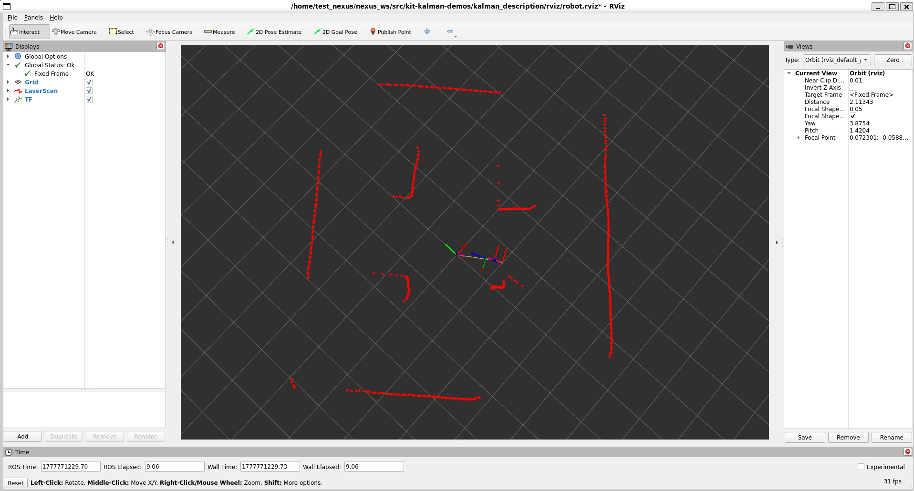
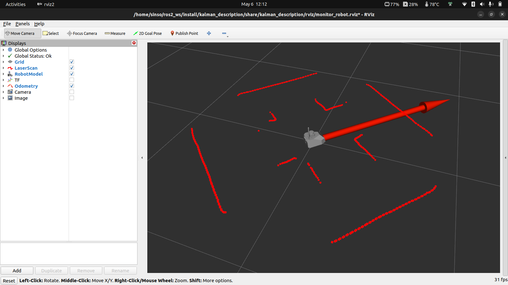
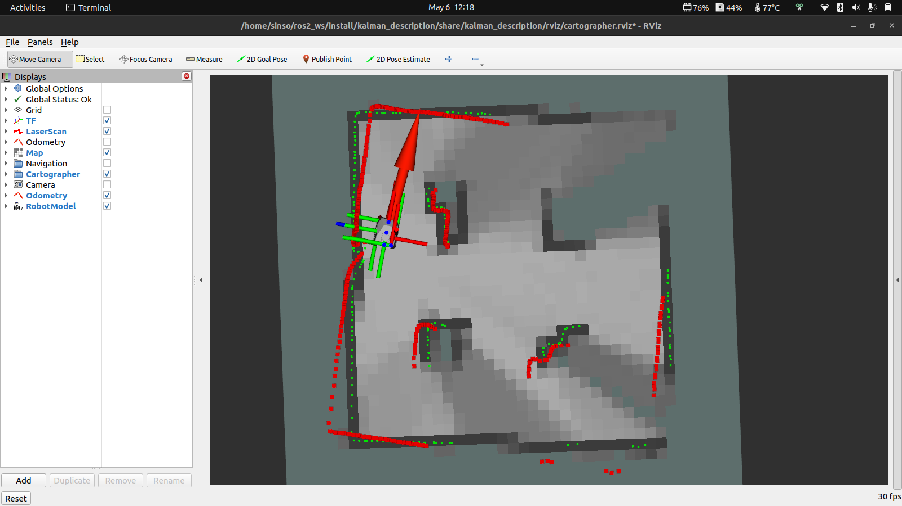
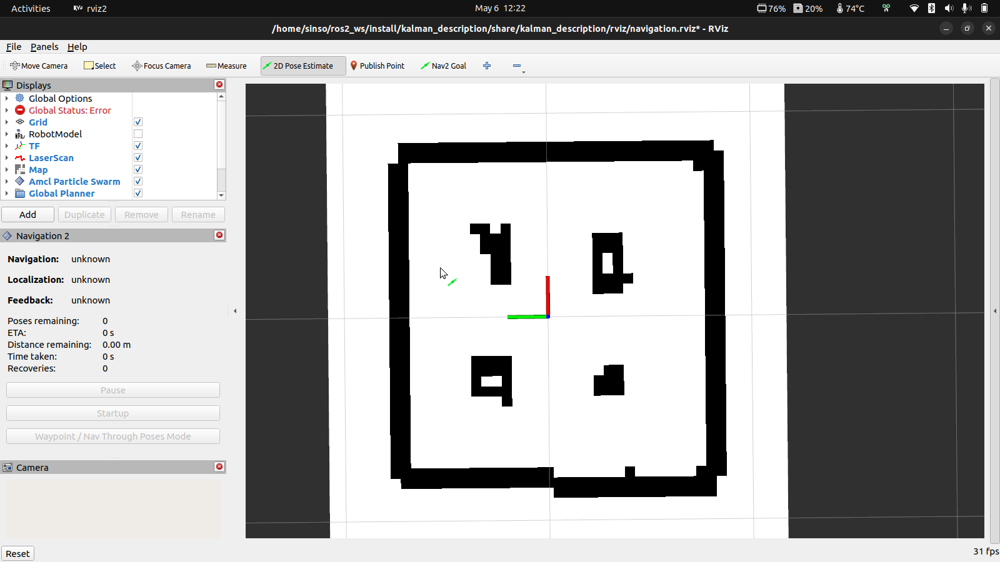
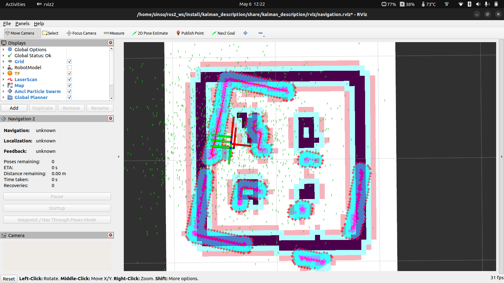
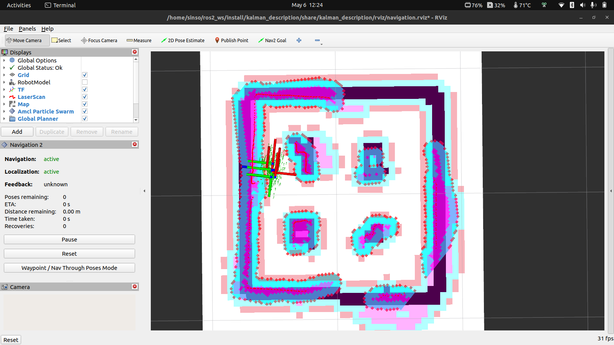
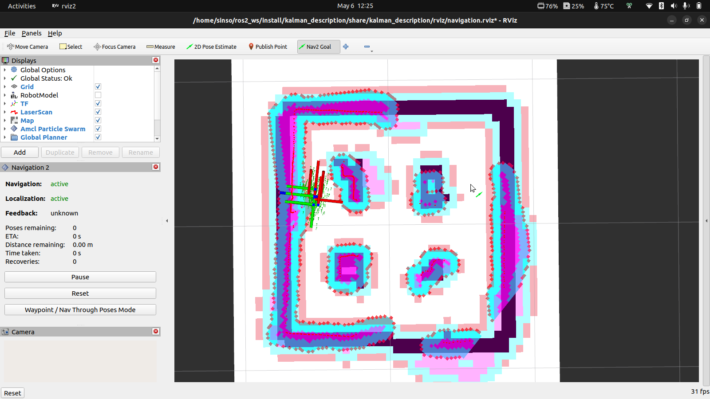
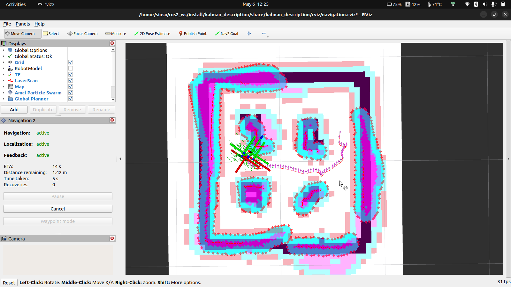

# Nexus Demos

Nodos ROS 2 de demostración para el Nexus. Diseñados para ejecutarse directamente desde tu laptop conectada al robot del laboratorio remoto.

Todos los códigos están en:

```
kalman_demos/kalman_demos/
```

Son archivos Python simples — ábrelos, léelos y modifícalos libremente. Cada uno es independiente y está pensado para que lo experimentes.

---

## Prerequisitos

- ROS 2 Humble instalado en tu laptop (esto se hace automáticamente la primera vez que ejecutas el comando de conexión al robot)
- Conectado al laboratorio remoto

---

## Inicio rápido

### 1. Crear el workspace y clonar

```bash
mkdir -p ~/nexus_ws/src
cd ~/nexus_ws/src
git clone --recursive https://github.com/Kalman-Robotics/kit-kalman-demos.git
```

> **Importante:** el clone debe hacerse dentro de `~/nexus_ws/src/`, no en `~/nexus_ws/`. Si ves errores de paquetes duplicados es porque el repo quedó en el lugar incorrecto.

El flag `--recursive` descarga también `kalman_interfaces`, que contiene los mensajes y servicios personalizados que usan los demos.

### 2. Instalar dependencias del sistema

```bash
cd ~/nexus_ws
sudo rosdep init
rosdep update
rosdep install --from-paths src --ignore-src -r -y
```

### 3. Compilar

```bash
cd ~/nexus_ws
colcon build --packages-up-to kalman
source install/setup.bash
echo "source ~/nexus_ws/install/setup.bash" >> ~/.bashrc
```

> [!TIP] **Orientación del robot:** la parte delantera se distingue por el logo de Kalman Robotics ubicado en el frontal del chasis.

---

## DEMOS

<details>
<summary><b>Demos disponibles</b></summary>

<!-- ## Demos disponibles -->

### Sin LiDAR

Estos demos solo necesitan odometría o IMU — el LiDAR puede estar apagado.

---

### `cuadrado` — Traza un cuadrado usando odometría

Para este primer demo se recomienda que el robot esté posicionado en un punto despejado para que pueda realizar el cuadrado. Puedes conseguirlo llevando al robot con el joystick virtual. Puedes aumentar el tamaño del cuadrado con el parámetro `lado`, pero asegúrate siempre de que haya suficiente espacio libre alrededor para que el robot no choque y complete el recorrido correctamente.


Abre un terminal nuevo y ejecuta:

```bash
ros2 run kalman_demos cuadrado
```

Para cambiar el tamaño del lado (en metros):

```bash
ros2 run kalman_demos cuadrado --ros-args -p lado:=0.4
```

**Qué hace:** El robot avanza un lado, gira 90°, y repite cuatro veces. Al completar el cuadrado el nodo se detiene solo.

**Qué usa:**
- `/odom` (`nav_msgs/Odometry`) — lee posición `(x, y)` y orientación `yaw` para saber cuánto ha avanzado y girado
- `/cmd_vel` (`geometry_msgs/Twist`) — envía comandos de velocidad lineal y angular

**Parámetro:** `lado` (metros, default `0.2`)

**Código:** [kalman_demos/cuadrado.py](kalman_demos/kalman_demos/cuadrado.py)

---

### `control_p` — Controlador proporcional de orientación

Para este demo se recomienda llevar al robot al centro del escenario como se muestra en la imagen.


**Qué hace:** El robot gira hasta alcanzar un ángulo objetivo (relativo a su orientación inicial) y se detiene. La velocidad angular es proporcional al error: gira rápido cuando está lejos del objetivo y frena suavemente al acercarse.

Abre un terminal nuevo y ejecuta. Puedes probar distintos ángulos — el robot girará hasta alcanzarlo y se detendrá:

**Ángulo por defecto (90°):** el robot gira 90° a la izquierda.

```bash
ros2 run kalman_demos control_p
```

**Ángulo personalizado (150°):** cambia el valor para girar más.

```bash
ros2 run kalman_demos control_p --ros-args -p angulo_objetivo:=150.0
```

**Ángulo negativo (-45°):** un valor negativo hace que el robot gire a la derecha.

```bash
ros2 run kalman_demos control_p --ros-args -p angulo_objetivo:=-45.0
```

> Cada vez que quieras probar un ángulo distinto, detén el nodo con `Ctrl+C` y vuelve a ejecutarlo con el nuevo valor.

**Qué usa:**
- `/odom` (`nav_msgs/Odometry`) — lee la orientación `yaw` actual del robot
- `/cmd_vel` (`geometry_msgs/Twist`) — envía velocidad angular proporcional al error

**Parámetro:** `angulo_objetivo` (grados, default `90.0`)

**Código:** [kalman_demos/control_p.py](kalman_demos/kalman_demos/control_p.py)

---

### `telemetria_live` — Dashboard en terminal

Abre un terminal nuevo y ejecuta:

```bash
ros2 run kalman_demos telemetria_live
```

**Qué hace:** Muestra un panel actualizado a 2 Hz con: posición `(x, y)` y orientación, velocidad lineal y angular, voltaje y porcentaje de batería, y ángulos roll/pitch del IMU. No envía nada al robot — es solo lectura.

> **Cómo usarlo:** abre el joystick en el navegador del laboratorio, mueve el robot y observa cómo cambian en tiempo real la posición y la velocidad en el panel. Para detener el panel, presiona `Ctrl+C` en el terminal.

**Qué usa:**
- `/odom` (`nav_msgs/Odometry`) — posición, orientación y velocidades
- `/cmd_vel` (`geometry_msgs/Twist`) — comandos de velocidad
- `/imu` (`sensor_msgs/Imu`) — roll y pitch

**Código:** [kalman_demos/telemetria_live.py](kalman_demos/kalman_demos/telemetria_live.py)

---

### Con LiDAR

El Nexus lleva un **LiDAR integrado** — uno de sus principales diferenciadores. Este sensor mide distancias en 360° alrededor del robot y es lo que permite esquivar obstáculos, seguir paredes o explorar un espacio de forma autónoma. Todos los demos de esta sección lo usan como fuente principal de percepción.

El LiDAR está **apagado por defecto**. Antes de ejecutar cualquiera de los siguientes demos, enciéndelo publicando una vez en su tópico de control:

```bash
ros2 topic pub -t 5 /lidar_power std_msgs/msg/Bool "data: true"
```

Una vez encendido, verifica que esté publicando:

```bash
ros2 topic hz /scan
```

A partir de aquí ya puedes ejecutar los demos que usan el LiDAR.

---

### `radar` — Visualiza lo que ve el LiDAR en tiempo real

Antes de lanzar cualquier demo autónomo, se recomienda empezar aquí. Este demo te muestra exactamente qué está detectando el LiDAR del robot: los obstáculos aparecen como puntos en un mapa centrado en el robot, actualizado en tiempo real. Entender lo que ve el sensor es clave para interpretar el comportamiento de los demás demos.

Abre un terminal nuevo y ejecuta:

**Opción 1 — configuración por defecto:**

```bash
ros2 run kalman_demos radar
```

**Opción 2 — ajustar escala y radio de visión:** útil si quieres ver obstáculos más lejanos o con más detalle cercano.

```bash
ros2 run kalman_demos radar --ros-args -p escala:=0.05 -p radio:=2.0
```

**Qué hace:** Dibuja un mapa ASCII de 61×31 caracteres centrado en el robot donde cada `■` es un obstáculo detectado por el LiDAR, referenciado al frame de odometría (los puntos no se mueven al desplazarte). Se actualiza a ~2 Hz.

> **Visualización completa con RViz:** para ver el modelo del robot, el LiDAR y la odometría en tiempo real con gráficos, usa RViz:
>
> ```bash
> ros2 run rviz2 rviz2 -d ~/nexus_ws/src/kit-kalman-demos/kalman_description/rviz/robot.rviz
> ```



**Qué usa:**
- `/scan` (`sensor_msgs/LaserScan`) — lecturas del LiDAR convertidas a coordenadas del mundo
- `/odom` (`nav_msgs/Odometry`) — posición del robot en el mundo para referenciar los puntos

**Parámetros:** `escala` (metros por celda, default `0.05`) · `radio` (alcance máximo a mostrar en metros, default `2.0`)

**Código:** [kalman_demos/radar.py](kalman_demos/kalman_demos/radar.py)

---

### `evitar_obstaculos` — Avanza y esquiva obstáculos

Gracias al LiDAR, el robot puede detectar obstáculos antes de chocar y decidir hacia dónde esquivarlos. Este demo es una buena introducción a cómo el sensor se traduce en comportamiento reactivo.

Abre un terminal nuevo y ejecuta:

```bash
ros2 run kalman_demos evitar_obstaculos
```

**Qué hace:** El robot avanza en línea recta. Cuando el LiDAR detecta un obstáculo al frente a menos de 35 cm, gira hacia el lado con más espacio libre hasta despejarse y retoma el avance.

**Qué usa:**
- `/scan` (`sensor_msgs/LaserScan`) — lee las distancias al frente, izquierda y derecha que reporta el LiDAR
- `/cmd_vel` (`geometry_msgs/Twist`) — envía comandos de avance o giro según lo que detecte el sensor

**Código:** [kalman_demos/evitar_obstaculos.py](kalman_demos/kalman_demos/evitar_obstaculos.py)

---

### `explorador` — Patrullaje autónomo continuo

Este demo lleva el uso del LiDAR un paso más allá: en lugar de reaccionar solo cuando hay un obstáculo, el robot analiza continuamente todo el semicírculo frontal para elegir siempre la dirección más despejada.

Abre un terminal nuevo y ejecuta:

**Opción 1 — burbuja de seguridad por defecto (20 cm):**

```bash
ros2 run kalman_demos explorador
```

**Opción 2 — burbuja más grande (28 cm):** el robot se mantendrá más alejado de las paredes laterales.

```bash
ros2 run kalman_demos explorador --ros-args -p burbuja:=0.28
```

**Qué hace:** El robot siempre está en movimiento. Cada ciclo usa las lecturas del LiDAR para buscar la ventana más despejada en el semicírculo frontal y orienta el robot hacia allá suavemente. Si algún lateral entra en la "burbuja" de seguridad, corrige la dirección para alejarse. No hay estados discretos — el movimiento es fluido y continuo.

**Qué usa:**
- `/scan` (`sensor_msgs/LaserScan`) — análisis continuo del semicírculo frontal y laterales con el LiDAR
- `/cmd_vel` (`geometry_msgs/Twist`) — velocidad lineal constante + angular variable

**Parámetro:** `burbuja` (metros, radio de seguridad lateral, default `0.20`)

**Código:** [kalman_demos/explorador.py](kalman_demos/kalman_demos/explorador.py)

---

### `seguidor_paredes` — Sigue la pared izquierda

Este demo muestra cómo el LiDAR permite mantener una distancia precisa respecto a una superficie. El robot no sigue una trayectoria preprogramada — usa las mediciones del sensor en tiempo real para corregir su posición continuamente.

Abre un terminal nuevo y ejecuta:

```bash
ros2 run kalman_demos seguidor_paredes
```

**Qué hace:** El robot avanza manteniéndose a 35 cm de la pared izquierda usando un controlador proporcional. Si hay un obstáculo al frente, gira a la derecha. Si no hay pared cerca, avanza recto esperando encontrarla.

**Qué usa:**
- `/scan` (`sensor_msgs/LaserScan`) — mide con el LiDAR la distancia frontal y a la pared izquierda en tiempo real
- `/cmd_vel` (`geometry_msgs/Twist`) — velocidad lineal + corrección angular proporcional al error de distancia

**Código:** [kalman_demos/seguidor_paredes.py](kalman_demos/kalman_demos/seguidor_paredes.py)

---

## Resumen de tópicos usados

| Tópico | Tipo | Usado por |
|---|---|---|
| `/cmd_vel` | `geometry_msgs/Twist` | cuadrado, evitar_obstaculos, explorador, seguidor_paredes, control_p |
| `/odom` | `nav_msgs/Odometry` | cuadrado, control_p, telemetria_live, radar |
| `/scan` | `sensor_msgs/LaserScan` | evitar_obstaculos, explorador, seguidor_paredes, radar |
| `/lidar_power` | `std_msgs/Bool` | encender el LiDAR antes de los demos con `/scan` |

---

> **Simulación:** los demos `espiral`, `antivuelco` y las funciones de Mapeo y Navegación requieren más espacio o condiciones que el escenario físico no permite. Consulta [README_simulacion.md](README_simulacion.md) para ejecutarlos en Gazebo.

---
</details>

<details open>
<summary><b>Navegación autónoma</b></summary>

El Nexus puede construir un mapa del entorno, localizarse dentro de él y planificar rutas hacia un destino evitando obstáculos en tiempo real. Esta sección cubre el flujo completo: verificar sensores, mapear el espacio y luego navegar de forma autónoma.

Antes de empezar, asegúrate de que el LiDAR esté encendido:

```bash
ros2 topic pub -t 5 /lidar_power std_msgs/msg/Bool "data: true"
```

---

### Paso 1 — Verificar sensores con `monitor_robot`

Antes de mapear o navegar, conviene confirmar que el robot está publicando datos correctamente. Este launch abre RViz con el modelo del robot y sus sensores activos — si ves el modelo, el LiDAR y la odometría en pantalla, todo está listo para continuar.

```bash
ros2 launch kalman_bringup monitor_robot.launch.py use_sim_time:=false robot_model:=kalman_description
```

**Qué hace:** Lanza RViz configurado para mostrar el modelo 3D del robot, las lecturas del LiDAR en tiempo real y los frames TF. Es una verificación rápida antes de iniciar cualquier operación autónoma.

**Qué usa:**
- `/scan` (`sensor_msgs/LaserScan`) — lecturas del LiDAR
- `/odom` (`nav_msgs/Odometry`) — posición y orientación del robot
- `/tf` / `/tf_static` — árbol de transformaciones del robot

<p align="center">
  <br/>
  <em>RViz mostrando el modelo 3D del robot, las lecturas del LiDAR y el árbol de transformaciones — señal de que todos los sensores están activos.</em>
</p>

Cuando hayas confirmado que los sensores están activos, cierra este launch con `Ctrl+C` y continúa al siguiente paso.

---

### Paso 2 — Construir el mapa con `cartographer`

Con los sensores verificados, el siguiente paso es mapear el entorno. Mueve el robot lentamente por todo el espacio — cuanto más lo recorras, mejor será el mapa resultante.

```bash
ros2 launch kalman_bringup cartographer.launch.py use_sim_time:=false robot_model:=kalman_description
```

**Qué hace:** Lanza Cartographer SLAM, que combina las lecturas del LiDAR con la odometría para construir un mapa de ocupación en tiempo real. RViz muestra el mapa creciendo a medida que el robot explora.

**Qué usa:**
- `/scan` (`sensor_msgs/LaserScan`) — contornos del entorno detectados por el LiDAR
- `/odom` (`nav_msgs/Odometry`) — desplazamiento acumulado del robot
- `/tf` — posición del robot dentro del mapa

> **Tip:** mueve el robot despacio y con giros amplios para que Cartographer tenga tiempo de procesar cada zona. Los pasillos estrechos o esquinas sin recorrer quedan como zonas desconocidas en el mapa.

<p align="center">
  <br/>
  <em>Mapa de ocupación en construcción: blanco = espacio libre, negro = obstáculo, gris = zona no explorada aún.</em>
</p>

Cuando el mapa se vea completo, **guárdalo antes de cerrar el launch**. Abre un terminal nuevo, navega a la carpeta donde quieres guardar el mapa y ejecuta:

```bash
cd ~/nexus_ws/src/kit-kalman-demos/kalman_bringup/map
ros2 run nav2_map_server map_saver_cli -f mapa_kalman
```

Esto genera dos archivos en la carpeta actual: `mapa_kalman.yaml` (metadatos del mapa: resolución, origen, ruta a la imagen) y `mapa_kalman.pgm` (la imagen del mapa en sí). Ambos son necesarios para el siguiente paso.

---

### Paso 3 — Navegar de forma autónoma con `navigation`

Con el mapa guardado, ya puedes lanzar la navegación autónoma. El robot usará el mapa para localizarse y planificar rutas hacia cualquier punto que le indiques.

```bash
ros2 launch kalman_bringup navigation.launch.py use_sim_time:=false robot_model:=kalman_description slam:=False
```

Por defecto usa el mapa instalado al compilar el paquete (`/nexus_ws/install/kalman_bringup/share/kalman_bringup/map/mapa_kalman.yaml`). Si tienes tu propio mapa, pásalo con el argumento `map`:

```bash
ros2 launch kalman_bringup navigation.launch.py use_sim_time:=false robot_model:=kalman_description slam:=False map:=/ruta/a/tu_mapa.yaml
```

**Qué hace:** Lanza Nav2 con el mapa existente. El robot planifica rutas, evita obstáculos en tiempo real y se desplaza de forma autónoma hacia los objetivos que le indiques desde RViz.

**Qué usa:**
- `/scan` (`sensor_msgs/LaserScan`) — detección de obstáculos en tiempo real durante la navegación
- `/odom` (`nav_msgs/Odometry`) — estimación de posición dentro del mapa
- `/map` (`nav_msgs/OccupancyGrid`) — mapa de referencia para planificación de rutas
- `/cmd_vel` (`geometry_msgs/Twist`) — comandos de velocidad generados por Nav2

**Cómo usarlo una vez lanzado:**

1. En RViz, selecciona la herramienta **"2D Pose Estimate"** y marca la posición inicial del robot en el mapa. Si el robot no reconoce bien su posición, gíralo manualmente un par de veces para mejorar la localización.

<table align="center">
  <tr><td align="center"><br/><em>Seleccionar la herramienta y hacer clic en el mapa</em></td></tr>
  <tr><td align="center"><br/><em>Pose enviada — las partículas del AMCL aparecen dispersas</em></td></tr>
  <tr><td align="center"><br/><em>Tras girar el robot, las partículas convergen y la localización mejora</em></td></tr>
</table>

2. Selecciona la herramienta **"2D Nav Goal"** y haz clic en el destino dentro del mapa. El robot calculará una ruta y se desplazará automáticamente hasta allí.

<table align="center">
  <tr><td align="center"><br/><em>Seleccionar destino con la herramienta 2D Nav Goal</em></td></tr>
  <tr><td align="center"><br/><em>Nav2 calcula la ruta y el robot se desplaza automáticamente</em></td></tr>
</table>

---

## Resumen de launches de navegación

| Launch | Propósito |
|---|---|
| `monitor_robot` | Verificar sensores y modelo en RViz antes de operar |
| `cartographer` | Mapeo SLAM con LiDAR + odometría |
| `navigation` | Navegación autónoma con Nav2 usando mapa existente o SLAM |

</details>
